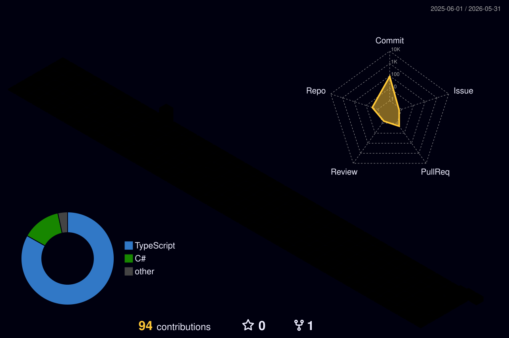

# 👋 Hi there, I'm Nicolas Gomes!

🧑‍💻 Software Engineer.
💜 Passionate about technology, leveraging it to solve complex challenges and build impactful projects.
🔎 Always in search of new knowledge and technologies, enhancing my skills daily.

---

### 🌟 About Me
With over 4 years of experience, I specialize in the **.NET ecosystem** and **React**, focused on microservices architecture and scalable systems. I thrive on transforming complex business requirements into robust, reliable, and high-performance technical solutions.

### 🛠 Tech Stack

### 🚀 Core Expertise
*   **Architecture:** Microservices, Clean Architecture, DDD, CQRS.
*   **Methodologies:** Agile/Scrum, TDD, SOLID, Clean Code.
*   **Infrastructure:** CI/CD Pipelines, Docker, Distributed Systems.

---

### 📊 GitHub Activity
*(Generated daily via GitHub Actions)*

  

---

### 🌐 Let's connect
📧 **Email:** nicolasgomes56@outlook.com
🔗 **LinkedIn:** [linkedin.com/in/nicolasgomes56](https://linkedin.com/in/nicolasgomes56)
